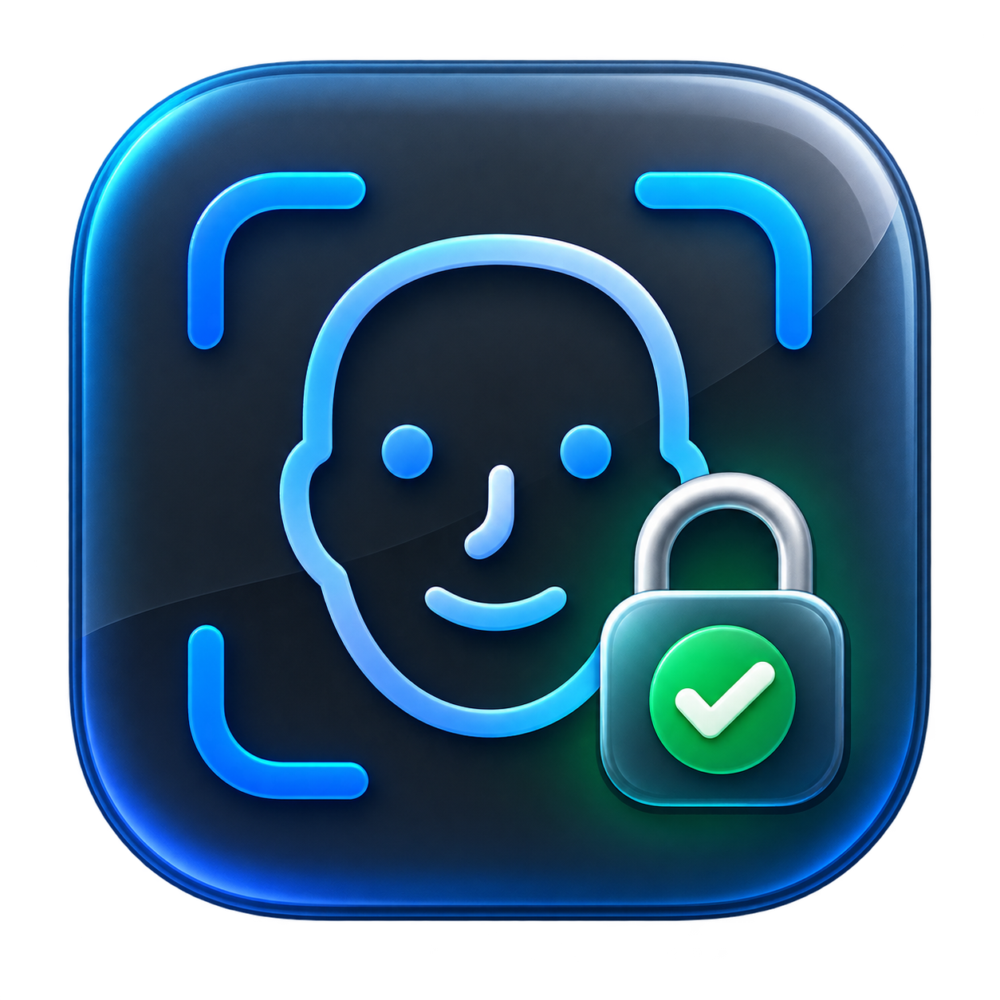
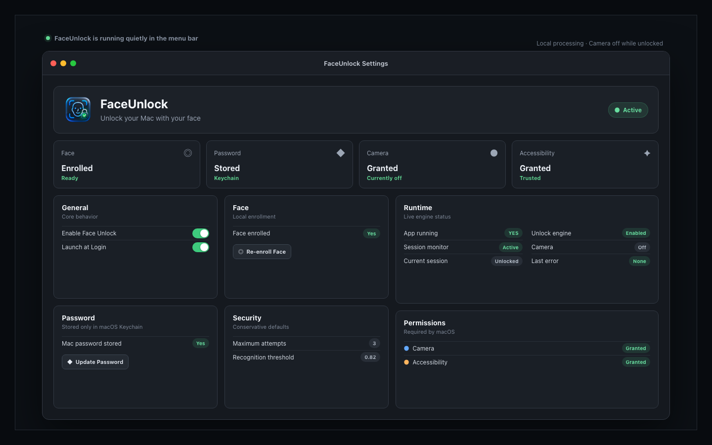

  

  <h1>FaceUnlock</h1>

  
<strong>Desbloqueie seu Mac com um olhar.</strong>

  
Reconhecimento facial local para macOS, com câmera sob demanda e uma experiência silenciosa na barra de menus.

  

    
    
    
    
    
  

 

## Seu Mac, pronto quando você estiver

FaceUnlock transforma a tela bloqueada em um fluxo simples e natural. O app fica discreto na barra de menus, observa apenas o estado da sessão e inicia o reconhecimento quando o macOS entra na Lock Screen.

  <strong>Lock Screen</strong>
  &nbsp;→&nbsp; câmera ativa
  &nbsp;→&nbsp; liveness
  &nbsp;→&nbsp; identidade confirmada
  &nbsp;→&nbsp; Mac desbloqueado

## Feito para desaparecer

Durante o uso normal, FaceUnlock permanece em idle: câmera desligada, reconhecimento parado e nenhum monitoramento visual contínuo. A câmera é ativada somente durante cadastro, teste ou autenticação na tela bloqueada, e é interrompida assim que o fluxo termina.

| | Experiência |
|---|---|
| **Câmera sob demanda** | Permanece desligada enquanto a sessão está desbloqueada. |
| **Reconhecimento local** | Detecção facial, landmarks e liveness são processados no próprio Mac. |
| **Liveness temporal** | A decisão considera múltiplos frames, piscada e movimento natural. |
| **Integração nativa** | Funciona em segundo plano como um app de menu bar para macOS. |

## Privacidade por arquitetura

Nenhum frame da câmera é enviado para servidores. O template facial permanece local no dispositivo e a senha do macOS fica exclusivamente no Keychain do sistema.

Após uma correspondência facial válida, FaceUnlock recupera a credencial do Keychain e a envia à Lock Screen nativa por eventos de teclado do macOS. O projeto não modifica `AuthorizationDB`, PAM, SIP, FileVault ou `loginwindow`.

## Tecnologia

  
  
  
  

`Vision` cuida da análise facial, `AVFoundation` controla a câmera integrada, `Security.framework` protege a credencial e `CoreGraphics` conclui o fluxo na tela nativa do macOS.

## Estado do projeto

FaceUnlock é um experimento funcional desenvolvido e validado em um MacBook Air M1. Não é um substituto oficial para Touch ID ou para os mecanismos biométricos da Apple, e ainda não é distribuído como produto pronto para usuários finais.

O código está público para estudo, evolução e auditoria. Considerações de segurança e dados locais estão documentadas em [SECURITY.md](SECURITY.md).

---

  Projetado e desenvolvido por <a href="https://github.com/LuidgiVarela">Luidgi Varela</a>.

